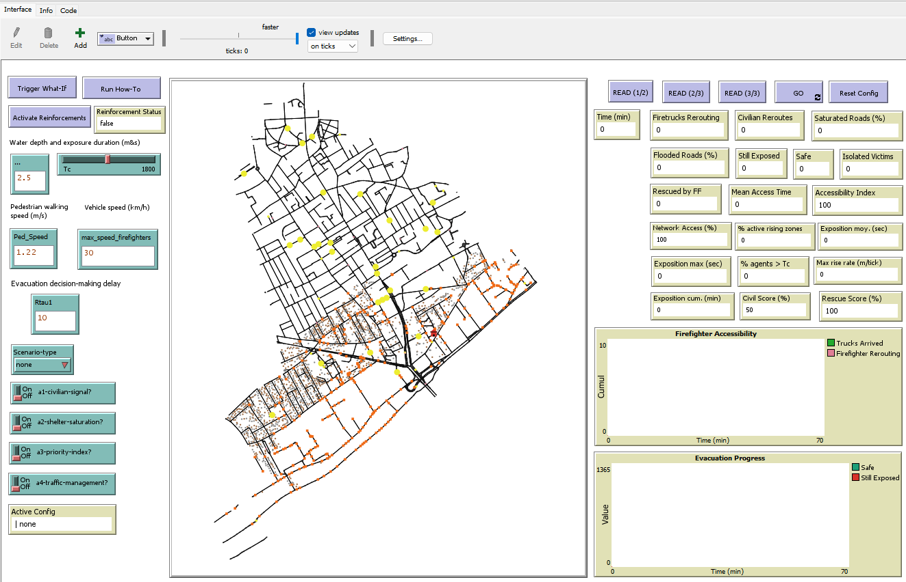
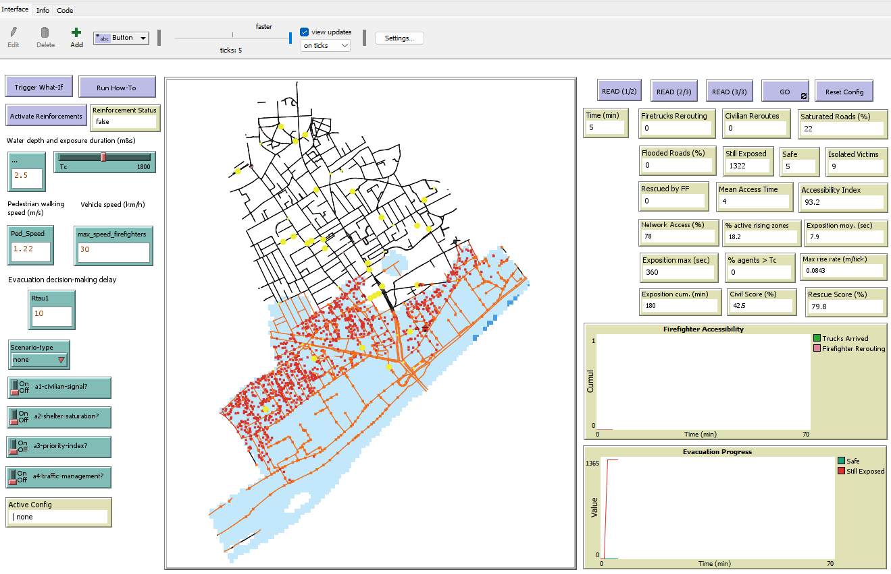
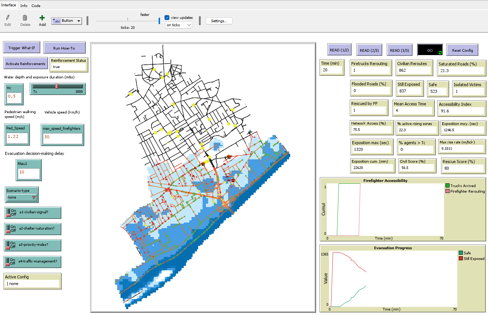
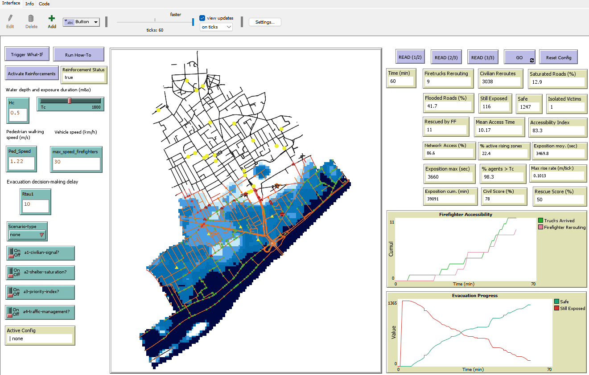

# Multi-Agent Model of Firefighter Access and Evacuation in the Event of Flooding
### Application to the Municipality of Bezons (Val-d'Oise, Île-de-France)

This repository presents a multi-agent simulation model developed with NetLogo 6.x. It enables the study of how residents evacuate and how emergency services respond during a flood in a dense urban area.

The model was designed based on the municipality of Bezons (in the Val-d'Oise department), but can be adapted to other cities exposed to flood risk.

It incorporates realistic resident behaviours such as reaction time, transport mode choice, and stress responses to rising water. It also includes a detailed representation of the road network, fire trucks, and allows testing of different strategies to improve the effectiveness of emergency response.

---

## Quick Start

Clone the repository and open the `.nlogo` file with NetLogo 6.x.

> ⚠️ **Do not open this file with a version of NetLogo earlier than 6.** Some features may be lost.

---

## Prerequisites

- **NetLogo 6.4 or higher**
- Extensions included by default in NetLogo: `gis`, `csv`, `table`
- Operating system: Windows, macOS or Linux

---

## Instructions

### 1. Update GIS Paths

First, open `FirefighterAccessibilitySimulation.nlogo` and locate the `read-gis-files` procedure. Replace each occurrence with the absolute path to the `data/` folder on your own machine. For example:

```
C:/Users/YourName/FirefighterAccessibilitySimulation/data/
```

### 2. Configure Parameters (Left Panel of the Interface)

Description of each available parameter:

**Water Depth and Exposure Duration**

- `Hc`: pedestrian discomfort threshold (critical water depth), in metres.
  Recommended value: 0.5 m (drowning risk threshold for people,
  [DREAL Centre-Val de Loire](https://www.centre-val-de-loire.developpement-durable.gouv.fr/cartographies-sur-le-risque-inondation-a4620.html)).
  Beyond `1.5 × Hc` (i.e. 0.75 m), a pedestrian may be immobilised.

- `Tc`: maximum water exposure duration, in seconds, beyond which an agent is considered at serious risk. Default value: 1800 s (30 min).

**Movement Speeds**

- `Ped_Speed`: pedestrian walking speed in m/s.
  Recommended value: 1.22 m/s (normal walking pace).

- `max_speed_firefighters`: maximum speed of fire trucks in km/h.
  Recommended value: 30 km/h (reduced speed in crisis conditions).
  This speed automatically decreases based on water depth.

**Evacuation Decision Delay**

- `Rtau1`: time parameter, in seconds, of the Rayleigh distribution.
  Controls the mean reaction delay of residents before evacuation.
  Default value: 10 s.

**What-If Scenarios**

- `scenario-type`: perturbation scenario to activate:
  - `none` — progressive flood under nominal conditions, used as a reference
  - `comm-failure` — all formal alert channels (radio, app) are disabled, forcing the system to operate without institutional communication
  - `fast-flood` — water rise accelerated by 50%, simulating a high-intensity flood event

**Operational Strategies (A1–A4)**

- `a1-civilian-signal?`: civilian signals to firefighters.
- `a2-shelter-saturation?`: rerouting when a shelter is saturated.
- `a3-priority-index?`: prioritisation by accessibility index.
- `a4-traffic-management?`: active management of traffic saturation.

> 💡 The active configuration is displayed at the bottom of the left panel under **Active Config** (e.g. `A3 | none`).

> 🔧 **Advanced parameters**: Other internal variables (alert channels, number of buses, secondary civilian agents, etc.) can be configured directly in the `load1` procedure of the NetLogo script for users wishing to further customise the simulation.

### 3. Load the Model

Click in the following order:

| Button | Action |
|--------|--------|
| **Load 1** | Loads the road network and flood data, then initialises global variables |
| **Load 2** | Loads the population, computes routes and generates civilian flows |
| **Load 3** | Loads fire stations and optionally activates the what-if scenario |
| **GO** | Runs the simulation (duration: 60 simulated minutes) |

> Once the simulation starts, a message is sent within the first 5 minutes to activate reinforcements if the first responders are overwhelmed.

> ℹ️ **Load 1, 2 and 3 must be clicked each time a parameter is changed.**
> Otherwise, changes will not take effect.

### 4. Run the Simulation

The simulation runs over **60 simulated minutes** (1 tick = 60 seconds).
Agents change colour according to their state. At the end of the simulation:

| Colour | Meaning |
|--------|---------|
| 🟥 Red | Resident or population still exposed |
| 🟩 Green | Business in flood zone |
| ▲ Yellow | School in flood zone |
| 🟠 Orange | Pedestrian currently evacuating |
| 🔵 Blue | Agent evacuated, in safety |
| 🟣 Magenta | Isolated victim, unreachable by emergency services |
| 🚒 Red | Fire truck and on-foot firefighters on mission |
| 🩷 Pink | Fire truck currently rerouting |
| 🟡 Yellow | Horizontal evacuation shelter |
| Orange road | Road in flooded zone |

---

## Repository Structure

```
FirefighterAccessibilitySimulation/
│
├── README.md
├── LICENSE
│
├── FirefighterAccessibilitySimulation.nlogo
│
├── data/
│   ├── road_network.shp (.dbf .prj .shx)
│   ├── shelter_locations.shp ...
│   ├── population_distribution.shp ...
│   ├── cis_bezons.shp ...
│   ├── Ecole_ZIP.shp ...
│   ├── Entreprises_ZIP.shp ...
│   └── flood.asc
│
└── results/
    ├── screenshots/
    │   ├── t0.png
    │   ├── t05.png
    │   ├── t20.png
    │   └── t60.png
    └── videos/
        ├── 01_baseline_evacuation.mp4
        ├── 02_A1_civilian_signals.mp4
        ├── 03_A2_shelter_saturation.mp4
        ├── 04_A3_priority_index.mp4
        ├── 05_fast_flood.mp4
        ├── 06_full_smart_config.mp4
        └── 07_comm_failure.mp4
```

---

## Input Data

### Road Network

Loaded from GIS shapefiles in the `data/road_network.*` folder. These files originate from the IGN BD TOPO and include traffic direction attributes (one-way or two-way).

### Evacuation Shelters

From the `data/shelter_locations.*` file. Two types of shelters are modelled: **horizontal** (`Hor`) for evacuation outside the flooded zone, and **vertical** (`Ver`) for in-place elevation.

### Population Distribution

From `data/population_distribution.*`. These data are derived from the 2020 INSEE Census at the IRIS scale, cross-referenced with building locations from OpenStreetMap and the BD TOPO.

### Flood Data

The `flood.asc` raster, derived from a Seine hydraulic simulation, is used to simulate the progressive flood inundation.

### Fire Stations

From the `data/cis_bezons.*` file (Centre d'Incendie et de Secours).
If fewer than three stations are detected, the model automatically generates additional ones from the nearest dry shelters to the flooded zone.

---

## What You Can Learn from This Model

The two main indicators are the **firefighter accessibility index** and the **evacuation time distribution**. These outputs allow analysis of:

- The impact of the four strategies A1–A4, individually or combined, on the number of rescued victims and firefighter response delays

- The effect of alert channels (radio, app, word of mouth, truck proximity) on the speed of resident mobilisation and the spontaneous evacuation rate

- The robustness of the response system under disruptions (blocked roads, rapid water rise, shelter saturation, communication failure)

- The optimal positioning of reinforcement fire stations

- Mixed civilian and emergency service congestion dynamics and their adaptive resolution

---

## Simulation Overviews

| t = 0 min | t = 5 min | t = 20 min | t = 60 min |
|-----------|------------|------------|------------|
|  |  |  |  |
| *Initial state of the model* | *Start of water rise: the first residents begin moving* | *Congestion on main roads: fire trucks are rerouted* | *Final state of a simulation: flooded zone with victims still exposed in 🟥, orange roads, businesses in 🟩 and schools as ▲ Yellow* |

---

## 📽️ Simulation Videos

Videos are available in the [`results/videos/`](./results/videos/) folder.
Each video corresponds to a specific configuration of the operational strategies:

| Video | `a1-civilian-signal?` | `a2-shelter-saturation?` | `a3-priority-index?` | `a4-traffic-management?` | `scenario-type` |
|-------|:---------------------:|:------------------------:|:--------------------:|:------------------------:|:---------------:|
| [01_baseline_evacuation.mp4](./results/videos/01_baseline_evacuation.mp4) | ❌ | ❌ | ❌ | ❌ | `none` |
| [02_A1_civilian_signals.mp4](./results/videos/02_A1_civilian_signals.mp4) | ✅ | ❌ | ❌ | ❌ | `none` |
| [03_A2_shelter_saturation.mp4](./results/videos/03_A2_shelter_saturation.mp4) | ❌ | ✅ | ❌ | ❌ | `none` |
| [04_A3_priority_index.mp4](./results/videos/04_A3_priority_index.mp4) | ❌ | ❌ | ✅ | ❌ | `none` |
| [05_fast_flood.mp4](./results/videos/05_fast_flood.mp4) | ❌ | ❌ | ❌ | ✅ | `fast-flood` |
| [06_full_smart_config.mp4](./results/videos/06_full_smart_config.mp4) | ✅ | ✅ | ✅ | ✅ | `none` |
| [07_comm_failure.mp4](./results/videos/07_comm_failure.mp4) | ❌ | ❌ | ❌ | ❌ | `comm-failure` |

These 7 scenarios are not exhaustive — many other combinations can be tested by freely enabling or disabling strategies A1, A2, A3 and A4, and by choosing a different scenario type (`none`, `comm-failure`, `fast-flood`).

### 🎬 Generating Simulation Videos

Videos were generated directly from NetLogo using a dedicated procedure (`export-video-script`) that automates the conversion of screenshots into `.mp4` video files.

### How It Works

1. **During the simulation**, NetLogo exports a `.png` image at regular intervals into the `simulation_images_for_videos/` folder.

2. **At the end of the simulation**, the `export-video-script` procedure automatically generates a `.bat` script (`conversion_of_simulation_images_to_video.bat`) that uses **ffmpeg** to assemble the images into a video:
   - Frame rate: **3 frames per second**
   - Output format: `.mp4` (H.264 codec, compatible with all players)
   - `.png` files are automatically deleted after conversion.

3. **Run the script**: double-click `conversion_of_simulation_images_to_video.bat` to launch the conversion.

### Prerequisites

- **ffmpeg** must be installed and accessible from the command line.
  Download: [https://ffmpeg.org/download.html](https://ffmpeg.org/download.html)

> ⚠️ Before using this procedure, update the `base-path` in the script to match your local installation.

> 💡 Once the video is generated, **rename the file** according to the simulated configuration (e.g. `01_baseline_evacuation.mp4`, `02_A1_civilian_signals.mp4`, etc.) before launching a new simulation, to avoid the next video overwriting the previous one.

---

## Funding and Supervision

This work was carried out as part of a CIFRE PhD thesis conducted at the Departmental Fire and Rescue Service of Val-d'Oise (SDIS 95) and the University of Le Havre Normandie. The thesis was conducted in partnership with the National Association for Research and Technology (ANRT) and the Ministry of Higher Education, Research and Innovation. It is part of a research programme on the analysis, modelling and anticipation of flood and wildfire risks, with the aim of optimising emergency response in urban and peri-urban areas of the Val-d'Oise.

---

## Associated Publications

This model is derived from the following work. If you use or adapt it, please cite the corresponding reference:

> **KOBENAN, K. R.** (2026). *Multi-risk analysis, forecasting and optimisation of firefighter interventions in the Val-d'Oise*.
> [Doctoral thesis, University of Le Havre Normandie].

---

## Scientific References

| Author(s) | Full Reference |
|-----------|----------------|
| Alonso Vicario et al. (2020) | Alonso Vicario, S., Mazzoleni, M., Bhamidipati, S., Gharesifard, M., Ridolfi, E., Pandolfo, C. & Alfonso, L. (2020). Unravelling the influence of human behaviour on reducing casualties during flood evacuation. *Hydrological Sciences Journal*, 65(14), 2359–2375. https://doi.org/10.1080/02626667.2020.1810254 |
| Bangate (2019) | Bangate, J. (2019). *Multi-agent modelling of a seismic crisis*. Doctoral thesis, Université Grenoble Alpes, 216p. ⟨tel-02613082⟩ |
| Banos, Lang & Marilleau (2015) | Banos, A., Lang, C. & Marilleau, N. (2015). *Agent-Based Spatial Simulation with NetLogo, Volume 1: Introduction and Bases*. ISTE Press – Elsevier, London, 267p. |
| Banos, Lang & Marilleau (2017) | Banos, A., Lang, C. & Marilleau, N. (2017). *Agent-Based Spatial Simulation with NetLogo, Volume 2: Advanced Concepts*. ISTE Press – Elsevier, London, 226p. |
| Douvinet (2018) | Douvinet, J. (2018). *Flash flood warning in France: Understanding and evaluating a changing process*. Habilitation thesis, Université d'Avignon et des Pays de Vaucluse, 265p. https://shs.hal.science/tel-02502482/ |
| Gillet et al. (2023) | Gillet, O., Daudé, E., Saval, A., Caron, C. & Rey-Coyrehourcq, S. (2023). ESCAPE - Agent-based simulation for population evacuation in emergency situations. *JFSMA - French-Speaking Conference on Multi-Agent Systems*, pp.128-131. Strasbourg. ⟨halshs-04199760⟩ |
| Mostafizi et al. (2017) | Mostafizi, A., Wang, H., Cox, D., Cramer, L. A. & Dong, S. (2017). Agent-based tsunami evacuation modeling of unplanned network disruptions for evidence-driven resource allocation and retrofitting strategies. *Natural Hazards*, 88(3), 1347–1372. https://doi.org/10.1007/s11069-017-2927-y |

---

## Author

**Kadjo Raphael KOBENAN**
[GitHub](https://github.com/KadjoRaphael) · [Email: raphael.kobenan@yahoo.fr]

---

## Licence

This project is available under the free [MIT](./LICENSE) licence.
You are free to use, modify and redistribute it with attribution.
